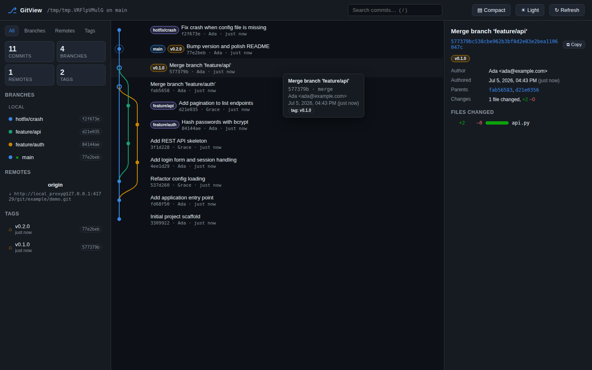
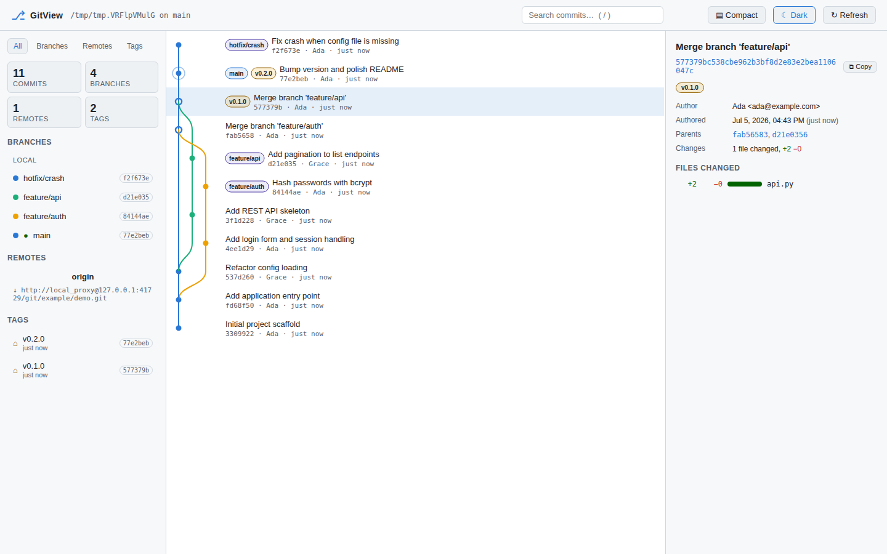

# GitView

**GitView** is a browser-based, interactive analyzer for git repositories. Point
it at any git-initialized project and it reads the project's `.git` directory to
render an interactive view of its **commits, branches, remotes and tags** —
including a graph/tree visualization of history — right in your browser.

It uses **only the Python standard library** (plus the `git` executable), so
there is nothing to `pip install`.




## Features

- 📊 **Interactive commit graph** — a rail-based tree/graph of all branches with
  smooth branch/merge curves, merge commits drawn as rings and `HEAD` marked
  with a halo, all rendered as SVG (no external JS libraries).
- 🖱️ **Hover tooltips** — hover any row for a summary (hash, author, date, refs)
  without leaving the graph.
- 🔎 **Search** — press `/` and type to filter commits by message, author, hash
  or ref; `Enter` / `Shift+Enter` cycles through matches.
- ⌨️ **Keyboard navigation** — `↑` / `↓` move the selection through history.
- 🌗 **Light & dark themes** — toggle in the top bar; the lane palette is
  stepped per theme and validated for color-vision-deficiency separation.
- ▤ **Compact / comfortable density** — switch between a roomy two-line view
  and a dense one-line-per-commit view.
- 🌿 **Branches** — local and remote-tracking branches with upstreams, current
  `HEAD` marked; hovering a branch highlights its tip commit in the graph.
- 🔗 **Remotes** — every configured remote with fetch/push URLs.
- 🏷️ **Tags** — lightweight and annotated tags linking to their target commit.
- 🔍 **Commit details** — click any commit (or branch/tag) to see author,
  committer, dates, clickable parent links, full message, a copy-hash button
  and per-file `+/-` counts with proportional diff bars.
- 🖥️ **Everything in one browser window** — a single-page app served locally.

## Requirements

- Python 3.8+
- `git` available on your `PATH`

## Usage

From the repository you want to inspect:

```bash
python -m gitview                 # analyze the current directory
python -m gitview /path/to/repo   # analyze another repository
python -m gitview --port 9000     # choose a port (use 0 for a random free port)
python -m gitview --no-browser    # do not auto-open a browser
```

Or use the convenience launcher:

```bash
./gitview.py /path/to/repo
```

GitView starts a small local web server (default
<http://127.0.0.1:8000/>), opens your browser, and serves the whole UI and its
data from there.

## How it works

GitView never modifies your repository. It shells out to git *plumbing*
commands — which operate directly on the `.git` directory — and exposes the
results as JSON:

| Endpoint | Description |
| --- | --- |
| `GET /api/info` | Repo path, current branch, and counts |
| `GET /api/commits?limit=N` | Commits in topological order with parents |
| `GET /api/branches` | Local + remote-tracking branches |
| `GET /api/remotes` | Configured remotes and their URLs |
| `GET /api/tags` | Tags and their target commits |
| `GET /api/commit/<hash>` | Full detail + changed files for one commit |

The front end (in `gitview/static/`) fetches these endpoints and computes the
commit-graph lane layout in the browser.

## Project layout

```
gitview/
├── gitview/
│   ├── __init__.py      # package metadata
│   ├── __main__.py      # CLI entry point (python -m gitview)
│   ├── repo.py          # reads/analyzes the .git directory via git
│   ├── server.py        # stdlib HTTP server + JSON API
│   └── static/          # single-page front end (HTML/CSS/JS)
├── gitview.py           # convenience launcher
├── tests/
│   └── test_repo.py     # tests against a throwaway repo
├── pyproject.toml
└── README.md
```

## Running the tests

```bash
python -m unittest discover -s tests
```

## License

MIT — see [LICENSE](LICENSE).
